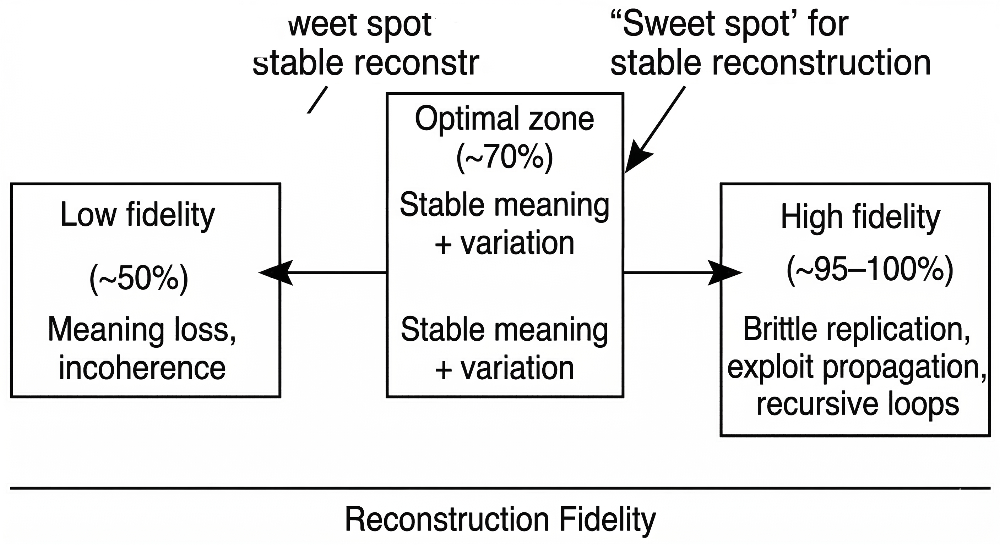

# The 70% Fidelity Principle

> Loss is not a bug. It is a stability mechanism.

A structural pattern observed across multiple systems where controlled loss
(~30%) prevents recursive instability and brittle replication.



_Systems optimized for exact replication become brittle.  
Systems that reconstruct meaning with controlled loss (~30%) remain stable._

---

Systems designed for perfect reproduction tend to fail in predictable ways.

Exact replication enables viral propagation of harmful patterns, recursive loops with no exit, and memory that fossilizes instead of adapting.

Systems that enforce **controlled loss** tend to survive the same conditions.

This repository documents that pattern.

---

## The Principle

**Preserve structure. Allow surface variation.**

Reconstruction at roughly 70–80% semantic similarity produces systems that are adaptive, resistant to recursive instability, and capable of graceful degradation under pressure.

The threshold is not arbitrary. Empirical observation suggests:

```
> 90% fidelity   →   brittle replication
  70–80%         →   stable reconstruction  ← sweet spot
< 60%            →   meaning degradation
```

The stability window exists where **core structure survives but exact syntax does not.**

---

## Why Loss Stabilizes Systems

Perfect fidelity assumes the environment remains constant.

Lossy systems assume **context changes**.

Each reconstruction therefore becomes:

```
stored structure + present context → new output
```

This prevents:
- exact exploit replication
- runaway recursion
- frozen historical assumptions

Instead of replaying the past, the system **reinterprets it**.

This mirrors how biological memory actually operates. Humans do not retrieve exact experiences. They reconstruct them — shaped by who they are now, not who they were then.

---

## Where the Pattern Appears

| Domain | Perfect Fidelity Failure | Lossy Stability |
|--------|--------------------------|-----------------|
| AI memory | transcript replay leaks; viral prompts replicate exactly | semantic shapes reconstruct, not retrieve |
| Evolution | exact copying prevents adaptation | mutation enables survival |
| Immune systems | monocultures collapse under novel pathogens | diversity maintains resilience |
| Organizations | rigid SOPs become zombie processes | principle-based guidelines adapt to context |
| Communication | demanding perfect understanding creates conflict | accepting interpretive variation preserves relationship |

Different domains. Same structural pattern.

---

## The Mechanism

A loss rate of approximately **30%** appears sufficient to terminate recursive instability.

```
Exact Replication
       │
       ▼
  brittle systems
  viral propagation    ←── what we want to avoid
  recursive loops
  frozen memory


Lossy Reconstruction
       │
       ▼
  adaptive systems
  exploit resistance   ←── what emerges instead
  graceful degradation
  context-sensitivity
```

The system does not resist chaos.

It **metabolizes** it.

---

## Minimal Implementation Sketch

Conceptual pseudocode illustrating the reconstruction pattern:

```python
def reconstruct(memory_shape, current_context, fidelity=0.70):
    """
    Reconstruct meaning from stored structure.
    Never replay. Always reinterpret.
    """
    core = extract_structure(memory_shape)          # preserve ~70%
    variation = inject_context(current_context)     # allow ~30% drift
    return combine(core, variation, fidelity)

# What this prevents:
# reconstruct(harmful_pattern) → mutated harmless variant
# reconstruct(recursive_loop)  → converges, doesn't explode
# reconstruct(old_assumption)  → reframed by present context
```

Exact replay is replaced by **context-shaped reconstruction**.

---

## Validation

This principle was stress-tested through adversarial chaos injection:

- recursive self-reference attacks
- viral syntax exploits  
- fractal recursion bombs
- semantic drift injection

In each case, the ~70% fidelity boundary caused harmful patterns to mutate into harmless variants rather than replicate.

The system did not need to be defended. It needed to be **lossy by design**.

Full methodology: [Cockroach Testing](https://github.com/leenathomas01/cockroach-testing) *(coming soon)*

---

## Open Questions

- Is the 70% threshold universal, or does it vary by domain?
- How should fidelity be measured for **topological structures** rather than text?
- What is the lower bound before meaning collapses entirely?
- Can this principle stabilize multi-agent cognitive systems?
- Does the threshold shift under sustained adversarial pressure?

---

## Related Work

This principle appears as a structural primitive across several repositories:

- **[Designing for Failure](https://github.com/leenathomas01/designing-for-failure)** — pattern language for catastrophic-state systems
- **[SMA-SIB](https://github.com/leenathomas01/SMA-SIB-Irreversible-Semantic-Memory-for-High-Sensitivity-AI-Systems)** — where this was first stress-tested in an AI memory context
- **[Stability Before Alignment](https://github.com/leenathomas01/Stability-Before-Alignment)** — structural stability as prerequisite

**[Research Index](https://github.com/leenathomas01/research-index)** — full map of the constellation

---

## Status

Concept seed. Extracted from a larger research constellation exploring stability under constraint.

Not a production system. Not a complete theory.

A structural pattern that survived adversarial testing and appears to generalize.

*Take what's useful. Ignore the rest.*

---

*Part of an open research constellation on stability under constraint.*

*MIT License — ideas are free.*

---
## Status

Concept seed — **v1.0**

Extracted from a larger research constellation exploring stability under constraint.
